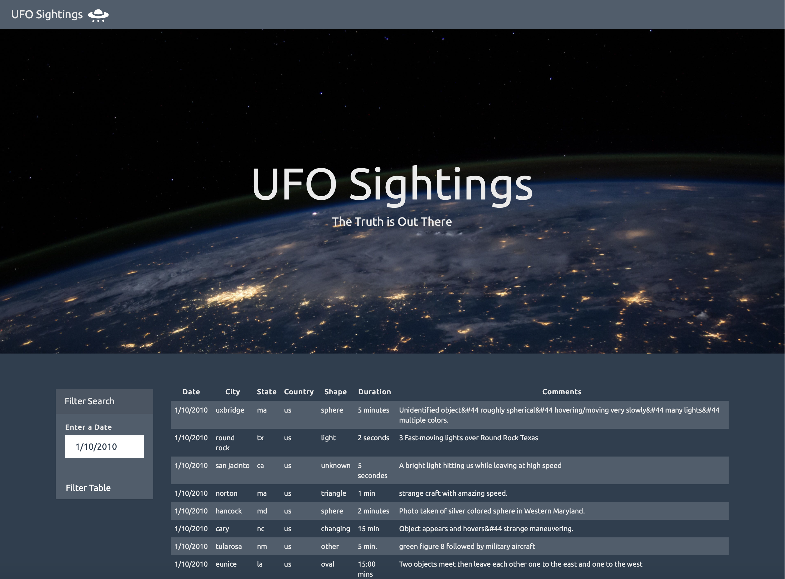
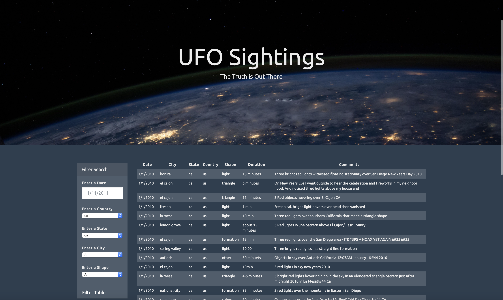

# javascript-challenge
JavaScript and DOM Manipulation
## Summary
Collection of eye-witness reports of extra-terrestrial life on Earth.
## UFO-level-1: Automatic Table and Date Search
Reports are displayed on a dynamically built table from the file data.js, each row is appended according to each UFO sighting.

Reports can be filtered by date in the format D/M/YYYY.

## UFO-level-2: Multiple Search Categories

Multiple filters can be set and search for UFO sightings using the following criteria based on the table columns:

1. Date
2. Country
3. State
4. City
5. Shape

